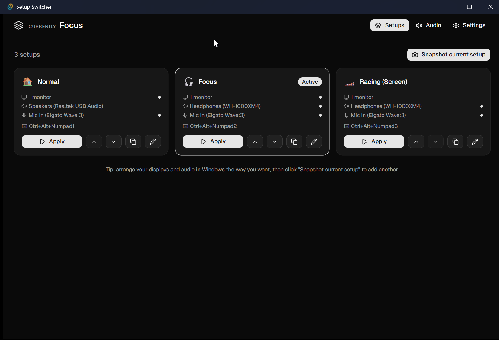
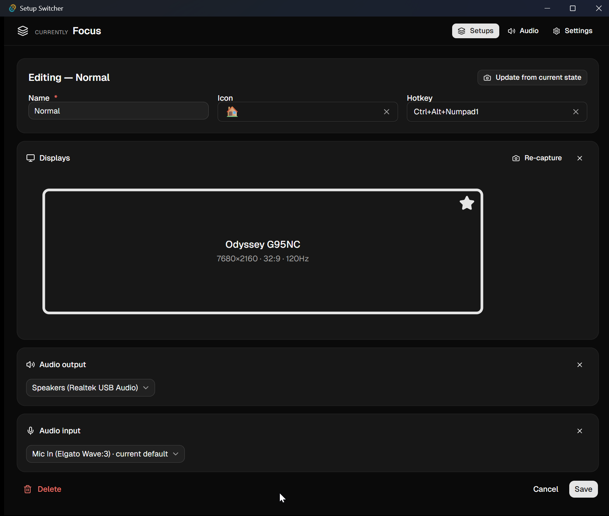
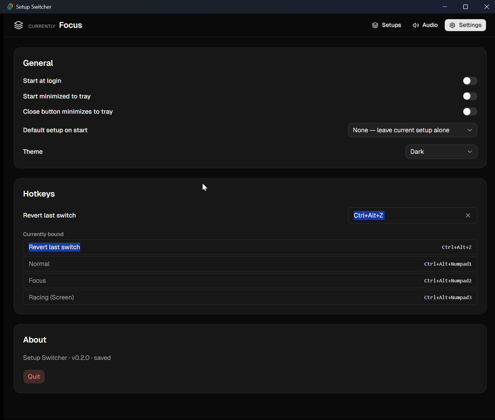

# Setup Switcher

A small Windows app that switches your monitor layout and default audio devices with a hotkey or from the tray.

[Download the latest release](https://github.com/FloreKoen/setup-switcher/releases/latest)

## What it does

You save your monitor layout and audio defaults as a Setup. Then you switch between Setups with:

- a global hotkey (like Ctrl+Alt+1)
- the tray menu
- a click on a card

That's pretty much the whole idea.

Each Setup has three parts you can set or leave alone:

- monitor layout (which screens are on, where they sit, which one is primary, what resolution)
- default audio output (speakers, headphones, etc.)
- default audio input (your mic)

Parts you leave empty stay alone when applying. So you can make a Setup that only switches audio. Or only displays. Or all three.

## The editor

You build a Setup by first arranging your displays and audio in Windows the way you want, then clicking "Snapshot current setup." It captures the current state. You give it a name, an emoji and a hotkey.

The editor shows a diagram of your monitor layout with the primary one marked. The audio dropdowns flag whichever device is currently the default.

If you change your mind later, hit "Update from current state" to re-snapshot the parts you have set without touching the rest.

## Settings

- Start at login. No admin rights needed and no UAC prompt.
- Close button minimizes to the tray instead of quitting.
- Pick a default Setup that applies on app start.
- One global hotkey for "revert last switch."
- The hotkey panel lists every binding so you can spot conflicts.

## Install

Download the MSI installer from the release page and run it. No admin rights needed.

WebView2 runtime is required. Windows 11 already has it.

## Requirements

Windows 10 21H1 or later, 64-bit.

## Quick start

1. Download an installer and run it.
2. Open Setup Switcher. It lives in the system tray.
3. Arrange your screens and audio in Windows the way you want.
4. Click "Snapshot current setup."
5. Name it, give it an emoji and a hotkey, hit Save.
6. Change your screens or audio in Windows, snapshot a second Setup.
7. Press your hotkey. The first Setup snaps back.

## How it works

Display switching uses the Windows CCD API. Monitor identity sticks around if you reboot, change ports, or swap a USB-C cable, because we identify each monitor by its stable device path.

Audio switching uses an undocumented COM interface called IPolicyConfig. It's the same trick SoundSwitch and NirSoft use. There is no official Windows API for setting the default audio device from a user app, so this is what you do.

## Privacy

No network requests. State is stored locally in `%APPDATA%\com.fl0re.screen-switcher\store.json`. If you want to back up your Setups, copy that file.

Source code lives in a separate private repository. Builds here are produced from it.
